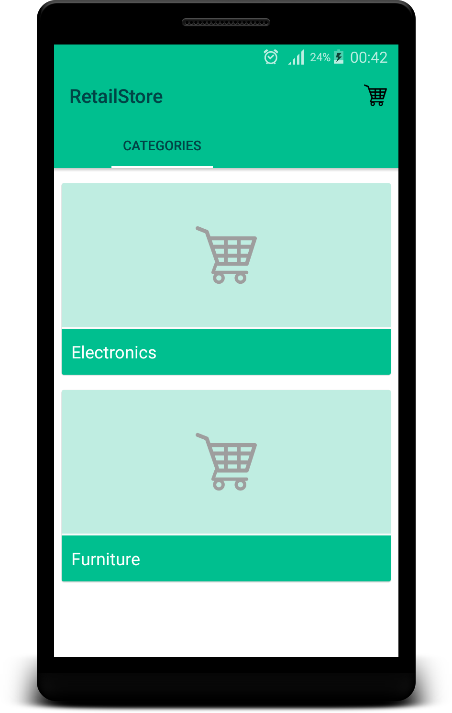
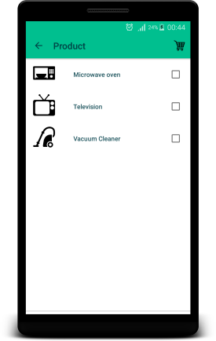
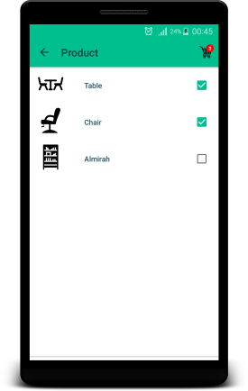

# RetailStore

This Solution has been developed completely using android native and with keeping material design in mind.

External libraries and tools has been used in order to solve retail store problem:

Third party libraries:

1- Butter Knife Version 7.0.1
   http://jakewharton.github.io/butterknife/
   
2- Glide version 3.5.2
   https://github.com/bumptech/glide
   
3- CardView Version 23.0.1

4- RecyclerView Version 23.0.1

5- Pallete  Version 23.0.1

6- Flat icons

Explanation:

Retail store has been designed to keep certain things in mind:

1- Simple user interface

2- Better transition effect

3- Smooth loading of images

4- And of course without crash :)

* All third parties library licenses are mentioned in licenses.html file inside assets directory of a project.
* Product icons are free to use which has been downloaded from http://www.flaticon.com/ with their licenses.
* Launcher icons has been generated by web tools provided by romannurik
 https://romannurik.github.io/AndroidAssetStudio/icons-launcher.html

Assumptions:

* All categories and products with icons are existed into local database of an application under retail_store Sqlite file.
* As application not to be designed for tablets, but still it should work up to 7 inches screen sizes.
* As of now application supports only portrait mode.

Minimum SDK version: 4.0.3
Target SDK version: 6.0

ScreenShots:

